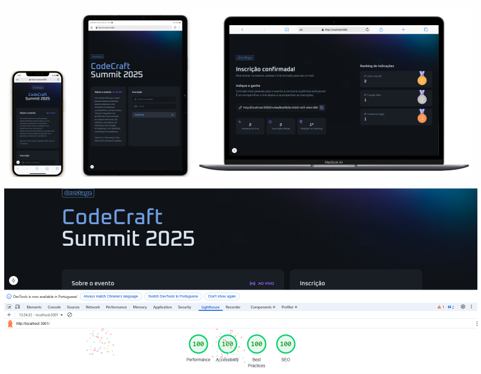

# ⚡ Projeto - Connect

## 🚀 Bem-vindo ao projeto Connect!

Este projeto foi desenvolvido com:

- **🌐 REACT**
- **⚙️ NEXT.js**
- **🎨 Tailwind CSS**
- **🐳 Docker**

## Finalidade:

#### Este projeto tem como objetivo rastrear e contabilizar os links de afiliados copiados ou cadastrados, exibindo um ranking com as informações mais relevantes.

## Instruções para rodar o projeto

Antes de começar, certifique-se de ter o Node.js e o npm instalados em seu ambiente de desenvolvimento.

- Node.js: [Baixar Node.js](https://nodejs.org/)
- npm (gerenciador de pacotes do Node.js): Geralmente instalado junto com o Node.js

## Instalação - API com Banco de Dados

1. Baixe o projeto em arquivo zip para seu ambiente local e navegue até a pasta api do projeto:

   ```bash
   cd api
   ```

2. Instale as dependências necessárias do projeto utilizando npm:

   ```bash
   npm install
   ```

3. Instale o programa do Docker, abra o Docker e execute os comandos abaixo para rodar a API:

   ```bash
   docker compose up -d
   ```

4. Rodar as migrações do banco de dados:

   ```bash
   npm run db:migrate
   ```

5. Iniciar o servidor de desenvolvimento:

   ```bash
   npm run dev
   ```

   ######

## Instalação - Front

1. Navegue até a pasta web:

   ```bash
   cd api
   ```

2. Instale as dependências necessárias do projeto utilizando npm:

   ```bash
   npm install
   ```

3. Iniciar o servidor de desenvolvimento:

   ```bash
   npm run dev
   ```

## Mais Detalhes sobre o Projeto

#### Função: Biblioteca Next para construir interfaces de usuário em JavaScript, permitindo a criação de componentes reutilizáveis.

#### Comando de Instalação para criar uma aplicação Next.js do zero:

```bash
npx create-next-app@latest --empty
```

## Bibliotecas utilizadas:

### 1. lucide-react

#### Função: Biblioteca de ícones para React, proporcionando ícones leves e personalizáveis.

#### Comando de Instalação:

```bash
npm install lucide-react
```

### 2. @biomejs/biome

#### Função: Ferramenta para formatação de código e linting, mantendo o código consistente e limpo.

#### Comando de Instalação:

```bash
npm install @biomejs/biome -D
```

### 3. react-hook-form

#### Função: Biblioteca para gerenciar formulários em React de forma eficiente, com validação de dados.

#### Comando de Instalação:

```bash
npm install react-hook-form
```

### 4. zod & @hookform/resolvers

#### Função: Zod é uma biblioteca de validação de dados, enquanto @hookform/resolvers integra o Zod com o React Hook Form para validação no formulário.

#### Comando de Instalação:

```bash
npm install zod @hookform/resolvers
```

### 5. orval

#### Função: Ferramenta para gerar clientes de API em TypeScript a partir de especificações OpenAPI.

#### Comando de Instalação:

```bash
npm i orval -D
```

&

```bash
npx orval
```

### 6. tailwind-merge

#### Função: Biblioteca para evitar conflitos entre classes do Tailwind CSS, realizando a mesclagem de classes de forma inteligente.

#### Comando de Instalação:

```bash
npm install tailwind-merge

```

### 7. tailwindcss, @tailwindcss/postcss, postcss

#### Função: Bibliotecas para configuração do Tailwind CSS com PostCSS, permitindo a criação de estilos utilitários e responsivos de maneira eficiente.

#### Comando de Instalação:

```bash
npm install tailwindcss @tailwindcss/postcss postcss

```

### 8. next/font/google

#### Função: Importa fontes do Google para otimizar o carregamento e a performance da aplicação.

#### Comando de Instalação:

#### Não requer instalação, já vem com o Next.js. A importação é feita diretamente no código:

```bash
import { Montserrat, Oxanium } from 'next/font/google';

```

### 9. twMerge

#### Função: Biblioteca para mesclar classes do Tailwind CSS, evitando duplicação e conflitos.

#### Comando de Instalação:

```bash
npm install tailwind-merge

```

Este projeto é totalmente responsivo, adaptando-se a diferentes tamanhos de tela e dispositivos e foi otimizado para alcançar a pontuação máxima no Google PageSpeed, garantindo excelente performance e experiência do usuário.

#### Muito aprendizado, novidades e atualizações incríveis com a Rocketseat 🚀


